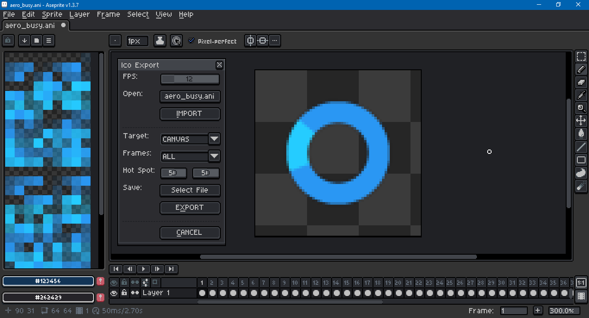

# Aseprite Ico Import & Export

This an [Aseprite](https://www.aseprite.org/) script to export `ani`s, `cur`s and `ico`s in 32 bit RGBA format, i.e., with translucency. It also has some import capability.

Aseprite can load and save `ico`s, but the files are unreadable by other graphics editors, and do not support alpha even when they should.

Export is limited to to the size 256 by 256 pixels. Image dimensions are rounded to the next greatest power of two (8, 16, 32, 64, 128, 256). The file is formatted as 32 bit RGBA regardless of the sprite's color mode (grayscale, indexed or RGB). Each frame is stored as a separate entry in the same file.

Import is limited to 8 bit indexed with 256 color palette; 24 bit RGB with 1 bit alpha; and 32 bit RGBA. The opened sprite is always in RGB color mode, regardless of the file format. Files containing compressed png data are not supported. *This script does not import Aseprite generated files.*

To read more about the format, see the [Wikipedia](https://en.wikipedia.org/wiki/ICO_(file_format)) entry and "[The evolution of the ICO file format](https://devblogs.microsoft.com/oldnewthing/20101018-00/?p=12513)" by Raymond Chen.

*This script was developed and tested in Aseprite version 1.3.7 on Windows 10.*

## Download

To download this script, click on the green Code button above, then select Download Zip. You can also click on the `icoio.lua` file. Beware that some browsers will append a `.txt` file format extension to script files on download. Aseprite will not recognize the script until this is removed and the original `.lua` extension is used. There can also be issues with copying and pasting. Be sure to click on the Raw file button. Do not copy the formatted code.

## Installation

To install this script, open Aseprite. In the menu bar, go to `File > Scripts > Open Scripts Folder`. Move the Lua script(s) into the folder that opens. Return to Aseprite; go to `File > Scripts > Rescan Scripts Folder`. The script should now be listed under `File > Scripts`. Select `icoio.lua` to launch the dialog.

If an error message in Aseprite's console appears, check if the script folder is on a file path that includes characters beyond ASCII, such as 'é' (e acute) or 'ö' (o umlaut).

## Usage

A hot key can be assigned to a script by going to `Edit > Keyboard Shortcuts`. The search input box in the top left of the shortcuts dialog can be used to locate the script by its file name.

Once open, holding down the `Alt` or `Option` key and pressing the underlined letter on a button will activate that button via keypress. For example, `Alt+C` will cancel the dialog.

## Modification

If you would like to modify this script, Aseprite's scripting API documentation can be found [here](https://aseprite.org/api/). If you use [Visual Studio Code](https://code.visualstudio.com/), I recommend the [Lua Language Server](https://github.com/LuaLS/lua-language-server) extension along with an [Aseprite type definition](https://github.com/behreajj/aseprite-type-definition).